# EMR 5.30集成Apache Ranger 2.x

## 说明
将Apache Ranger 2.1与Amazon EMR集成，实现Hive，Presto应用基于数据库，表，列的权限控制。

整套环境的组件包括：
 - LDAP Server： 作为访问Hive/Presto的用户的数据库，实现用户登录认证的工作
 - Ranger Admin：管理
   - Policy Manager: 负责对Hive/Presto基于数据库，表和列级别的授权
   - User Sync：负责与LDAP Server同步用户
   - Solr Audit：负责用户访问Hive/Presto应用的行为审计，包括读写，查询等，以及RangerAdmin登录
   - Plugin：安装在EMR Master上，与Hive和Presto Server集成，拦截用户与Hive/presto之间的交互，并基于Ranger policymanager进行授权

**注意：**

**第一部分为安装OpenLDAP，也可以使用Amazon Directory Service中的SimpleAD来代替**

**第二部分中，Ranger的安装包需要用户自行build，默认Ranger2.x要求Hive版本为3.x，Presto只支持PrestoSQL，不支持Prestodb，所以本文后半部分使用的是自行**


## 一. 安装OpenLDAP

1. 安装OpenLDAP server

```shell
sudo yum install -y openldap openldap-servers openldap-clients openldap-devel
[ec2-user@ip-172-31-37-254 ~]$ sudo yum list installed | grep openldap
Existing lock /var/run/yum.pid: another copy is running as pid 3618.
Another app is currently holding the yum lock; waiting for it to exit...
  The other application is: yum
    Memory : 118 M RSS (335 MB VSZ)
    Started: Tue Sep 15 03:36:28 2020 - 00:04 ago
    State  : Running, pid: 3618
openldap.x86_64                       2.4.44-15.amzn2                installed
openldap-clients.x86_64               2.4.44-15.amzn2                @amzn2-core
openldap-devel.x86_64                 2.4.44-15.amzn2                @amzn2-core
openldap-servers.x86_64               2.4.44-15.amzn2                @amzn2-core
```

2. set OpenLDAP admin password
```
[ec2-user@ip-172-31-37-254 ~]$ slappasswd
New password:
Re-enter new password:
{SSHA}2+plyEGECw0IcAvelyt6LYHdbDAUN+Dx
```

3. 启动LDAP服务
```
sudo systemctl start slapd //启动 stop停止
sudo systemctl enable slapd //开机运行
sudo systemctl status slapd //查看运行状态及相关输出日志
```

4. Configure OpenLDAP
使用ldif配置修改OpenLDAP配置
```
vim domain_config.ldif
>> 
dn: olcDatabase={1}monitor,cn=config
changetype: modify
replace: olcAccess
olcAccess: {0}to * by dn.base="gidNumber=0+uidNumber=0,cn=peercred,cn=external,cn=auth" read by dn.base="cn=bdpadmin,dc=bnb,dc=internal" read by * none

dn: olcDatabase={2}hdb,cn=config
changetype: modify
add: olcRootPW
olcRootPW: *********   ##替换为上一步生成的password
-
replace: olcRootDN
olcRootDN: cn=bdpadmin,dc=bnb,dc=internal
-
replace: olcSuffix
olcSuffix: dc=bnb,dc=internal
-
add: olcAccess
olcAccess: {0}to attrs=userPassword by self write by dn.base="cn=bdpadmin,dc=bnb,dc=internal" write by anonymous auth by * none
olcAccess: {1}to * by dn.base="cn=bdpadmin,dc=bnb,dc=internal" write by self write by * read

##应用配置
sudo ldapadd -Y EXTERNAL -H ldapi:/// -f domain_config.ldif
```
5. 导入LDAP Schema
```
sudo ldapadd -Y EXTERNAL -H ldapi:/// -f /etc/openldap/schema/core.ldif
sudo ldapadd -Y EXTERNAL -H ldapi:/// -f /etc/openldap/schema/cosine.ldif
sudo ldapadd -Y EXTERNAL -H ldapi:/// -f /etc/openldap/schema/nis.ldif
sudo ldapadd -Y EXTERNAL -H ldapi:/// -f /etc/openldap/schema/inetorgperson.ldif

```

6. 创建Domain
```
vim domain.ldif
>> 
dn: dc=bnb,dc=internal
objectClass: dcObject
objectClass: organization
dc: bnb
o : bnb

sudo ldapadd -D "cn=bdpadmin,dc=bnb,dc=internal" -W -f domain.ldif
```

7. 创建OU
```
vim ou.ldif
>> 
dn: ou=tech,dc=bnb,dc=internal
objectclass: organizationalUnit
ou: tech
description: Container for tech user entries

sudo ldapadd -D "cn=bdpadmin,dc=bnb,dc=internal" -W -f ou.ldif
```

8. 导入Ldap数据库
```
sudo cp /usr/share/openldap-servers/DB_CONFIG.example /var/lib/ldap/DB_CONFIG
sudo chown ldap:ldap -R /var/lib/ldap
sudo chmod 700 -R /var/lib/ldap
```

9. 创建Ldap用户
```
##设置用户密码
slappasswd
{SSHA}ZBe7cAFfSv/63uKUuFIgdVRtLLQkFx4o
123456

vim users.ldif
>> 
dn: uid=hive,ou=tech,dc=bnb,dc=internal
sn: hive
cn: hive
objectClass: inetOrgPerson
userPassword: *******
uid: hive

dn: uid=presto,ou=tech,dc=bnb,dc=internal
sn: presto
cn: presto
objectClass: inetOrgPerson
userPassword: *******
uid: presto

dn: uid=hue,ou=tech,dc=bnb,dc=internal
sn: hue
cn: hue
objectClass: inetOrgPerson
userPassword: *******
uid: hue

dn: uid=atlas,ou=tech,dc=bnb,dc=internal
sn: atlas
cn: atlas
objectClass: inetOrgPerson
userPassword: *******
uid: atlas

dn: uid=ranger,ou=tech,dc=bnb,dc=internal
sn: ranger
cn: ranger
objectClass: inetOrgPerson
userPassword: *******
uid: ranger

dn: uid=atlasadmin,ou=tech,dc=bnb,dc=internal
sn: atlasadmin
cn: atlasadmin
objectClass: inetOrgPerson
userPassword: *******
uid: atlasadmin

dn: uid=hiveadmin,ou=tech,dc=bnb,dc=internal
sn: hiveadmin
cn: hiveadmin
objectClass: inetOrgPerson
userPassword: *******
uid: hiveadmin

dn: uid=prestoadmin,ou=tech,dc=bnb,dc=internal
sn: prestoadmin
cn: prestoadmin
objectClass: inetOrgPerson
userPassword: *******
uid: prestoadmin

sudo ldapadd -D "cn=bdpadmin,dc=bnb,dc=internal" -W -f users.ldif
```

10. 验证LDAP服务
```
sudo slaptest -u
config file testing succeeded #验证成功，否则失败
```
11. 测试User LDAP 连接
```
##bdpadmin
cn=bdpadmin,dc=bnb,dc=internal
password=1qazxsw2
ldapsearch -x -b dc=bnb,dc=internal -H ldap://127.0.0.1 -D cn=bdpadmin,dc=bnb,dc=internal -W

##ranger
uid=ranger,ou=tech,dc=bnb,dc=internal
password=123456
[ec2-user@ip-172-31-46-68 ~]$ ldapwhoami -x -D uid=ranger,ou=tech,dc=bnb,dc=internal -H ldap://127.0.0.1 -W
Enter LDAP Password:
dn:uid=ranger,ou=tech,dc=bnb,dc=internal

```

12. 限制anonymous登录
```
# Disable anonymous access
vim ldap_disable_bind_anon.ldif
>>
dn: cn=config
changetype: modify
add: olcDisallows
olcDisallows: bind_anon

dn: cn=config
changetype: modify
add: olcRequires
olcRequires: authc

dn: olcDatabase={-1}frontend,cn=config
changetype: modify
add: olcRequires
olcRequires: authc

sudo ldapadd -Y EXTERNAL -H ldapi:/// -f ldap_disable_bind_anon.ldif

##验证anonymous登录
[ec2-user@ip-172-31-46-68 ~]$ ldapsearch -x -LLL -b ldap://127.0.0.1
ldap_bind: Inappropriate authentication (48)
	additional info: anonymous bind disallowed
```

## 二. Build Ranger安装包

以下步骤以Ranger 2.0举例，Ranger 2.x版本均要求Hive版本3.x，所以默认不支持EMR 5.x版本，可以支持EMR 6.x

另外，Ranger2.x版本支持了PrestoSQL的官方插件，但是不支持Prestodb，所以无法支持EMR 5.x版本

**在后面安装Ranger Plugin的章节中，实际使用的是由AWS Blog提供的基于Ranger 2.1手动修改定制的Ranger Hive Plugin和Ranger Prestodb Plugin的安装包。**

1. 安装Build所需的包
```
#set -euo pipefail
#set -x
sudo yum -y install java-1.8.0
sudo yum install java-1.8.0-openjdk-devel.x86_64 -y

sudo yum -y remove java-1.7.0-openjdk

sudo yum install git -y
sudo yum install python3 -y
sudo pip3 install requests -y 
sudo yum install gcc g++ -y
```

2. Build Ranger
```
#git clone https://github.com/apache/ranger ##这是下载最新版本，目前是3.0.0-snapshot
#wget https://downloads.apache.org/ranger/2.0.0/apache-ranger-2.0.0.tar.gz
wget https://mirrors.koehn.com/apache/ranger/2.1.0/apache-ranger-2.1.0.tar.gz

#tar xzvf apache-ranger-2.0.0.tar.gz
tar xzvf apache-ranger-2.1.0.tar.gz

##需要mvn 3.6.3, python3, requests(pip3)
wget https://mirrors.tuna.tsinghua.edu.cn/apache/maven/maven-3/3.6.3/binaries/apache-maven-3.6.3-bin.tar.gz

##Download and Setup maven
sudo tar xf apache-maven-3.6.3-bin.tar.gz -C /opt
sudo su
export PATH=/opt/apache-maven-3.6.3/bin:$PATH
export MAVEN_OPTS=-Xmx2048m

##需要通过ls -l /etc/alternatives/java 查找JAVA HOME
export JAVA_HOME=/usr/lib/jvm/java-1.8.0-openjdk-1.8.0.265.b01-1.amzn2.0.1.x86_64
export PATH=$JAVA_HOME/bin:$PATH

## Start to build
#cd apache-ranger-2.0.0
cd apache-ranger-2.1.0

##可以在根目录下的pom.xml文件中查看Ranger对Maven，以及对各个Hadoop生态应用要求的版本
<hadoop.version>3.1.1</hadoop.version>
<ozone.version>0.4.0-alpha</ozone.version>
<hamcrest.all.version>1.3</hamcrest.all.version>
<hbase.version>2.0.2</hbase.version>
<hive.version>3.1.0</hive.version>
<hbase-shaded-protobuf>2.0.0</hbase-shaded-protobuf>
<hbase-shaded-netty>2.0.0</hbase-shaded-netty>
<hbase-shaded-miscellaneous>2.0.0</hbase-shaded-miscellaneous>

## 开始build
sudo mvn -DskipTests=false clean compile package install assembly:assembly 

[INFO] Reactor Summary for ranger 2.0.0:
[INFO] 
[INFO] ranger ............................................. SUCCESS [  0.513 s]
[INFO] Jdbc SQL Connector ................................. SUCCESS [  1.524 s]
[INFO] Credential Support ................................. SUCCESS [  0.731 s]
[INFO] Audit Component .................................... SUCCESS [  2.212 s]
[INFO] Common library for Plugins ......................... SUCCESS [  6.701 s]
[INFO] Installer Support Component ........................ SUCCESS [  0.229 s]
[INFO] Credential Builder ................................. SUCCESS [  0.521 s]
[INFO] Embedded Web Server Invoker ........................ SUCCESS [  0.776 s]
[INFO] Key Management Service ............................. SUCCESS [  1.664 s]
[INFO] ranger-plugin-classloader .......................... SUCCESS [  0.240 s]
[INFO] HBase Security Plugin Shim ......................... SUCCESS [  1.677 s]
[INFO] HBase Security Plugin .............................. SUCCESS [  2.372 s]
[INFO] Hdfs Security Plugin ............................... SUCCESS [  0.967 s]
[INFO] Hive Security Plugin ............................... SUCCESS [  1.727 s]
[INFO] Knox Security Plugin Shim .......................... SUCCESS [  0.454 s]
[INFO] Knox Security Plugin ............................... SUCCESS [  0.712 s]
[INFO] Storm Security Plugin .............................. SUCCESS [  0.545 s]
[INFO] YARN Security Plugin ............................... SUCCESS [  0.557 s]
[INFO] Ozone Security Plugin .............................. SUCCESS [  0.556 s]
[INFO] Ranger Util ........................................ SUCCESS [  1.551 s]
[INFO] Unix Authentication Client ......................... SUCCESS [  0.330 s]
[INFO] Security Admin Web Application ..................... SUCCESS [ 53.462 s]
[INFO] KAFKA Security Plugin .............................. SUCCESS [  0.515 s]
[INFO] SOLR Security Plugin ............................... SUCCESS [  0.747 s]
[INFO] NiFi Security Plugin ............................... SUCCESS [  2.609 s]
[INFO] NiFi Registry Security Plugin ...................... SUCCESS [  0.450 s]
[INFO] Unix User Group Synchronizer ....................... SUCCESS [  1.340 s]
[INFO] Ldap Config Check Tool ............................. SUCCESS [  0.351 s]
[INFO] Unix Authentication Service ........................ SUCCESS [  0.512 s]
[INFO] KMS Security Plugin ................................ SUCCESS [  0.649 s]
[INFO] Tag Synchronizer ................................... SUCCESS [  0.814 s]
[INFO] Hdfs Security Plugin Shim .......................... SUCCESS [  0.365 s]
[INFO] Hive Security Plugin Shim .......................... SUCCESS [  0.909 s]
[INFO] YARN Security Plugin Shim .......................... SUCCESS [  0.361 s]
[INFO] OZONE Security Plugin Shim ......................... SUCCESS [  0.425 s]
[INFO] Storm Security Plugin shim ......................... SUCCESS [  0.352 s]
[INFO] KAFKA Security Plugin Shim ......................... SUCCESS [  0.345 s]
[INFO] SOLR Security Plugin Shim .......................... SUCCESS [  0.573 s]
[INFO] Atlas Security Plugin Shim ......................... SUCCESS [  0.427 s]
[INFO] KMS Security Plugin Shim ........................... SUCCESS [  0.362 s]
[INFO] ranger-examples .................................... SUCCESS [  0.045 s]
[INFO] Ranger Examples - Conditions and ContextEnrichers .. SUCCESS [  0.325 s]
[INFO] Ranger Examples - SampleApp ........................ SUCCESS [  0.150 s]
[INFO] Ranger Examples - Ranger Plugin for SampleApp ...... SUCCESS [  0.457 s]
[INFO] Ranger Tools ....................................... SUCCESS [  0.662 s]
[INFO] Atlas Security Plugin .............................. SUCCESS [  0.655 s]
[INFO] Sqoop Security Plugin .............................. SUCCESS [  0.484 s]
[INFO] Sqoop Security Plugin Shim ......................... SUCCESS [  0.347 s]
[INFO] Kylin Security Plugin .............................. SUCCESS [  0.373 s]
[INFO] Kylin Security Plugin Shim ......................... SUCCESS [  0.309 s]
[INFO] Elasticsearch Security Plugin Shim ................. SUCCESS [  0.207 s]
[INFO] Elasticsearch Security Plugin ...................... SUCCESS [  0.407 s]
[INFO] Presto Security Plugin ............................. SUCCESS [  0.599 s]
[INFO] Presto Security Plugin Shim ........................ SUCCESS [  0.565 s]
[INFO] Unix Native Authenticator .......................... SUCCESS [  0.763 s]
[INFO] ------------------------------------------------------------------------
[INFO] BUILD SUCCESS
[INFO] ------------------------------------------------------------------------
[INFO] Total time:  26:41 min
[INFO] Finished at: 2020-09-16T05:44:04Z
[INFO] ------------------------------------------------------------------------
[root@ip-172-31-43-166 apache-ranger-2.0.0]# 
[root@ip-172-31-43-166 apache-ranger-2.0.0]# cd target/
[root@ip-172-31-43-166 target]# ls -l
total 1605044
drwxr-xr-x 2 root root        28 Sep 16 05:17 antrun
drwxr-xr-x 2 root root       113 Sep 16 05:42 archive-tmp
drwxr-xr-x 3 root root        22 Sep 16 05:17 maven-shared-archive-resources
-rw-r--r-- 1 root root 248549123 Sep 16 05:39 ranger-2.0.0-admin.tar.gz
-rw-r--r-- 1 root root 249664689 Sep 16 05:40 ranger-2.0.0-admin.zip
-rw-r--r-- 1 root root  27792642 Sep 16 05:41 ranger-2.0.0-atlas-plugin.tar.gz
-rw-r--r-- 1 root root  27831326 Sep 16 05:41 ranger-2.0.0-atlas-plugin.zip
-rw-r--r-- 1 root root  31560345 Sep 16 05:42 ranger-2.0.0-elasticsearch-plugin.tar.gz
-rw-r--r-- 1 root root  31605153 Sep 16 05:42 ranger-2.0.0-elasticsearch-plugin.zip
-rw-r--r-- 1 root root  26633840 Sep 16 05:37 ranger-2.0.0-hbase-plugin.tar.gz
-rw-r--r-- 1 root root  26665160 Sep 16 05:37 ranger-2.0.0-hbase-plugin.zip
-rw-r--r-- 1 root root  23970754 Sep 16 05:37 ranger-2.0.0-hdfs-plugin.tar.gz
-rw-r--r-- 1 root root  23996749 Sep 16 05:37 ranger-2.0.0-hdfs-plugin.zip
-rw-r--r-- 1 root root  23825939 Sep 16 05:37 ranger-2.0.0-hive-plugin.tar.gz
-rw-r--r-- 1 root root  23854012 Sep 16 05:37 ranger-2.0.0-hive-plugin.zip
-rw-r--r-- 1 root root  39934681 Sep 16 05:38 ranger-2.0.0-kafka-plugin.tar.gz
-rw-r--r-- 1 root root  39983157 Sep 16 05:38 ranger-2.0.0-kafka-plugin.zip
-rw-r--r-- 1 root root  90979985 Sep 16 05:40 ranger-2.0.0-kms.tar.gz
-rw-r--r-- 1 root root  91104656 Sep 16 05:41 ranger-2.0.0-kms.zip
-rw-r--r-- 1 root root  28379986 Sep 16 05:37 ranger-2.0.0-knox-plugin.tar.gz
-rw-r--r-- 1 root root  28410407 Sep 16 05:37 ranger-2.0.0-knox-plugin.zip
-rw-r--r-- 1 root root  23940279 Sep 16 05:41 ranger-2.0.0-kylin-plugin.tar.gz
-rw-r--r-- 1 root root  23979339 Sep 16 05:41 ranger-2.0.0-kylin-plugin.zip
-rw-r--r-- 1 root root     34248 Sep 16 05:40 ranger-2.0.0-migration-util.tar.gz
-rw-r--r-- 1 root root     37740 Sep 16 05:40 ranger-2.0.0-migration-util.zip
-rw-r--r-- 1 root root  26387332 Sep 16 05:38 ranger-2.0.0-ozone-plugin.tar.gz
-rw-r--r-- 1 root root  26420407 Sep 16 05:38 ranger-2.0.0-ozone-plugin.zip
-rw-r--r-- 1 root root  40297789 Sep 16 05:42 ranger-2.0.0-presto-plugin.tar.gz
-rw-r--r-- 1 root root  40340865 Sep 16 05:42 ranger-2.0.0-presto-plugin.zip
-rw-r--r-- 1 root root  22230522 Sep 16 05:41 ranger-2.0.0-ranger-tools.tar.gz
-rw-r--r-- 1 root root  22247463 Sep 16 05:41 ranger-2.0.0-ranger-tools.zip
-rw-r--r-- 1 root root     42230 Sep 16 05:40 ranger-2.0.0-solr_audit_conf.tar.gz
-rw-r--r-- 1 root root     45636 Sep 16 05:40 ranger-2.0.0-solr_audit_conf.zip
-rw-r--r-- 1 root root  26963884 Sep 16 05:38 ranger-2.0.0-solr-plugin.tar.gz
-rw-r--r-- 1 root root  27009332 Sep 16 05:39 ranger-2.0.0-solr-plugin.zip
-rw-r--r-- 1 root root  23952147 Sep 16 05:41 ranger-2.0.0-sqoop-plugin.tar.gz
-rw-r--r-- 1 root root  23985313 Sep 16 05:41 ranger-2.0.0-sqoop-plugin.zip
-rw-r--r-- 1 root root   4014441 Sep 16 05:41 ranger-2.0.0-src.tar.gz
-rw-r--r-- 1 root root   6257752 Sep 16 05:41 ranger-2.0.0-src.zip
-rw-r--r-- 1 root root  37234498 Sep 16 05:38 ranger-2.0.0-storm-plugin.tar.gz
-rw-r--r-- 1 root root  37268004 Sep 16 05:38 ranger-2.0.0-storm-plugin.zip
-rw-r--r-- 1 root root  32770127 Sep 16 05:40 ranger-2.0.0-tagsync.tar.gz
-rw-r--r-- 1 root root  32780737 Sep 16 05:40 ranger-2.0.0-tagsync.zip
-rw-r--r-- 1 root root  16255231 Sep 16 05:40 ranger-2.0.0-usersync.tar.gz
-rw-r--r-- 1 root root  16279286 Sep 16 05:40 ranger-2.0.0-usersync.zip
-rw-r--r-- 1 root root  23956192 Sep 16 05:38 ranger-2.0.0-yarn-plugin.tar.gz
-rw-r--r-- 1 root root  23991651 Sep 16 05:38 ranger-2.0.0-yarn-plugin.zip
-rw-r--r-- 1 root root         5 Sep 16 05:42 version
[root@ip-172-31-43-166 target]# 

```
## 三. 安装 Ranger Server

**可以登录到Ranger Server，直接运行install-ranger-admin-server.sh脚本**

如果需要手动一步步安装，请参考以下步骤

1. 设置环境变量
```
sudo su
hostip=`hostname -I | xargs`
installpath=/usr/lib/ranger
mysql_jar=mysql-connector-java-5.1.39.jar
ranger_admin=ranger-2.0.0-admin
ranger_user_sync=ranger-2.0.0-usersync
ldap_domain=bnb.internal 
ldap_server_url=ldap://172.31.46.68:389
ldap_base_dn=ou=tech,dc=bnb,dc=internal
ldap_bind_user_dn=uid=ranger,ou=tech,dc=bnb,dc=internal
ldap_bind_password=123456
ranger_s3bucket=https://hxh-tokyo.s3-ap-northeast-1.amazonaws.com/ranger/
```

2. 安装
```
sudo mkdir -p $installpath
cd $installpath

wget $ranger_s3bucket/$ranger_admin_server.tar.gz
wget $ranger_s3bucket/$ranger_user_sync.tar.gz
wget $ranger_s3bucket/$mysql_jar_location
wget $ranger_s3bucket/solr_for_audit_setup.tar.gz

#Install mySQL
#yum -y install mysql-server
#service mysqld start
#chkconfig mysqld on

yum -y install mariadb-server
service mariadb start
chkconfig mariadb on
mysqladmin -u root password rangeradmin || true
mysql -u root -prangeradmin -e "CREATE USER 'rangeradmin'@'localhost' IDENTIFIED BY 'rangeradmin';" || true
mysql -u root -prangeradmin -e "create database ranger;" || true
mysql -u root -prangeradmin -e "GRANT ALL PRIVILEGES ON *.* TO 'rangeradmin'@'localhost' IDENTIFIED BY 'rangeradmin'" || true
mysql -u root -prangeradmin -e "FLUSH PRIVILEGES;" || true

#准备安装包
sudo tar xvpfz $ranger_admin.tar.gz -C $installpath
sudo tar xvpfz $ranger_user_sync.tar.gz -C $installpath
cp $mysql_jar $installpath
cd $installpath

# Update ranger admin install.properties
sudo ln -s $ranger_admin ranger-admin
cd $installpath/ranger-admin
sudo cp install.properties install.properties_original
#sudo sed -i "s|#setup_mode=SeparateDBA|setup_mode=SeparateDBA|g" install.properties
sudo sed -i "s|SQL_CONNECTOR_JAR=.*|SQL_CONNECTOR_JAR=$installpath/$mysql_jar|g" install.properties
#sudo sed -i "s|db_host=.*|db_host=$db_host|g" install.properties
#sudo sed -i "s|db_root_user=.*|db_root_user=ranger|g" install.properties
sudo sed -i "s|db_root_password=.*|db_root_password=rangeradmin|g" install.properties
#sudo sed -i "s|db_user=.*|db_user=ranger|g" install.properties
sudo sed -i "s|db_password=.*|db_password=rangeradmin|g" install.properties
#sudo sed -i "s|db_name=.*|db_name=ranger_2_0|g" install.properties
sudo sed -i "s|policymgr_external_url=.*|policymgr_external_url=http://$hostip:6080|g" install.properties
sudo sed -i "s|rangerAdmin_password=.*|rangerAdmin_password=1qazxsw2|g" install.properties
sudo sed -i "s|rangerTagsync_password=.*|rangerTagsync_password=1qazxsw2|g" install.properties
sudo sed -i "s|rangerUsersync_password=.*|rangerUsersync_password=1qazxsw2|g" install.properties
sudo sed -i "s|keyadmin_password=.*|keyadmin_password=1qazxsw2|g" install.properties
#Update audit properties
sudo sed -i "s|audit_db_password=.*|audit_db_password=rangerlogger|g" install.properties
sudo sed -i "s|audit_store=.*|audit_store=solr|g" install.properties
sudo sed -i "s|#audit_solr_urls=.*|audit_solr_urls=http://$hostip:8983/solr/ranger_audits|g" install.properties


#Update LDAP properties
sudo sed -i "s|authentication_method=.*|authentication_method=LDAP|g" install.properties
sudo sed -i "s|xa_ldap_url=.*|xa_ldap_url=$ldap_server_url|g" install.properties
sudo sed -i "s|xa_ldap_userDNpattern=.*|xa_ldap_userDNpattern=uid={0},$ldap_base_dn|g" install.properties
sudo sed -i "s|xa_ldap_groupSearchBase=.*|xa_ldap_groupSearchBase=$ldap_base_dn|g" install.properties
sudo sed -i "s|xa_ldap_groupSearchFilter=.*|xa_ldap_groupSearchFilter=(member=uid={0},$ldap_base_dn)|g" install.properties
sudo sed -i "s|xa_ldap_groupRoleAttribute=.*|xa_ldap_groupRoleAttribute=cn|g" install.properties
sudo sed -i "s|xa_ldap_base_dn=.*|xa_ldap_base_dn=$ldap_base_dn|g" install.properties
sudo sed -i "s|xa_ldap_bind_dn=.*|xa_ldap_bind_dn=$ldap_bind_user_dn|g" install.properties
sudo sed -i "s|xa_ldap_bind_password=.*|xa_ldap_bind_password=$ldap_bind_password|g" install.properties
sudo sed -i "s|xa_ldap_referral=.*|xa_ldap_referral=ignore|g" install.properties
sudo sed -i "s|xa_ldap_userSearchFilter=.*|xa_ldap_userSearchFilter=(uid={0})|g" install.properties
sudo chmod +x setup.sh
sudo ./setup.sh

# Update ranger usersync install.properties
cd $installpath
sudo ln -s $ranger_user_sync ranger-usersync
cd $installpath/ranger-usersync
sudo cp install.properties install.properties_original
sudo sed -i "s|POLICY_MGR_URL =.*|POLICY_MGR_URL=http://$hostip:6080|g" install.properties
sudo sed -i "s|SYNC_SOURCE =.*|SYNC_SOURCE=ldap|g" install.properties
sudo sed -i "s|SYNC_LDAP_URL =.*|SYNC_LDAP_URL=$ldap_server_url|g" install.properties
sudo sed -i "s|SYNC_LDAP_BIND_DN =.*|SYNC_LDAP_BIND_DN=$ldap_bind_user_dn|g" install.properties
sudo sed -i "s|SYNC_LDAP_BIND_PASSWORD =.*|SYNC_LDAP_BIND_PASSWORD=123456|g" install.properties
sudo sed -i "s|SYNC_LDAP_SEARCH_BASE =.*|SYNC_LDAP_SEARCH_BASE=$ldap_base_dn|g" install.properties
sudo sed -i "s|SYNC_LDAP_USER_SEARCH_BASE =.*|SYNC_LDAP_USER_SEARCH_BASE=$ldap_base_dn|g" install.properties
sudo sed -i "s|SYNC_LDAP_USER_OBJECT_CLASS =.*|SYNC_LDAP_USER_OBJECT_CLASS=inetOrgPerson|g" install.properties
sudo sed -i "s|SYNC_LDAP_USER_SEARCH_FILTER =.*|SYNC_LDAP_USER_SEARCH_FILTER=objectclass=inetOrgPerson|g" install.properties
sudo sed -i "s|SYNC_LDAP_USER_NAME_ATTRIBUTE =.*|SYNC_LDAP_USER_NAME_ATTRIBUTE=uid|g" install.properties
sudo sed -i "s|SYNC_GROUP_SEARCH_ENABLED=.*|SYNC_GROUP_SEARCH_ENABLED=true|g" install.properties
sudo sed -i "s|SYNC_INTERVAL =.*|SYNC_INTERVAL=30|g" install.properties
sudo sed -i "s|rangerUsersync_password=.*|rangerUsersync_password=1qazxsw2|g" install.properties
sudo sed -i "s|SYNC_LDAP_DELTASYNC =.*|SYNC_LDAP_DELTASYNC=true|g" install.properties
sudo sed -i "s|logdir=logs|logdir=/var/log/ranger/usersync|g" install.properties
sudo chmod +x setup.sh
sudo -E ./setup.sh

#Download the install solr for ranger
cd $installpath
sudo tar -xvf solr_for_audit_conf.tar.gz
cd solr_for_audit_setup
sudo sed -i "s|#JAVA_HOME=.*|JAVA_HOME=/usr/lib/jvm/java-1.8.0-openjdk-1.8.0.252.b09-2.amzn2.0.1.x86_64/jre|g" install.properties
sudo sed -i "s|SOLR_INSTALL=.*|SOLR_INSTALLL=true|g" install.properties
sudo sed -i "s|SOLR_DOWNLOAD_URL=.*|SOLR_DOWNLOAD_URL=http://archive.apache.org/dist/lucene/solr/5.2.1/solr-5.2.1.tgz|g" install.properties
sudo sed -i "s|SOLR_HOST_URL=.*|SOLR_HOST_URL=http://$hostip:8983|g" install.properties
sudo sed -i "s|SOLR_RANGER_PORT=.*|SOLR_RANGER_PORT=8983|g" install.properties
sudo chmod +x setup.sh
sudo -E ./setup.sh


# #Change password
# Change rangerusersync user password in Ranger Admin Console, then Execute:
# sudo -E python ./updatepolicymgrpassword.sh

#Start Ranger Admin
# sudo /usr/bin/ranger-admin stop


#Start Ranger Usersync
# sudo /usr/bin/ranger-usersync stop
sudo /usr/bin/ranger-usersync start

#Start Ranger Audit 
# /opt/solr/ranger_audit_server/scripts/stop_solr.sh
sudo /opt/solr/ranger_audit_server/scripts/start_solr.sh

# The default usersync runs every 1 hour (cannot be changed). This is way to force usersync
#sudo echo /usr/bin/ranger-usersync restart | at now + 5 minutes
#sudo echo /usr/bin/ranger-usersync restart | at now + 7 minutes
#sudo echo /usr/bin/ranger-usersync restart | at now + 10 minutes
```

通过浏览器打开http://ranger-server:6080 验证ranger是否安装成功，默认用户名密码为admin/admin，如果在配置中修改了默认密码，请使用配置中的密码登录。


## 四. 启动EMR集群

启动EMR集群，选择Advanced Option
- 选择EMR 5.30版本，Hadoop，Hive，Hue，Spark，Presto
- 使用Glue作为Hive，Presto和Spark的Metadata
- 指定EMR Launch Configuration，包括Hue的LDAP配置，External Database，以及Metastore的配置
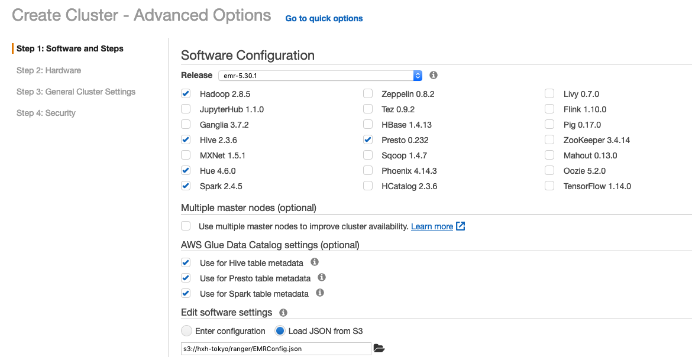

- 为EMR集群指定EC2 Key Pair，另外Presto如果使用用户名和密码认证，则要求使用https，所以需要在Security Configuration中指定证书（Security Configuration需要提前配置，具体参考官方文档）
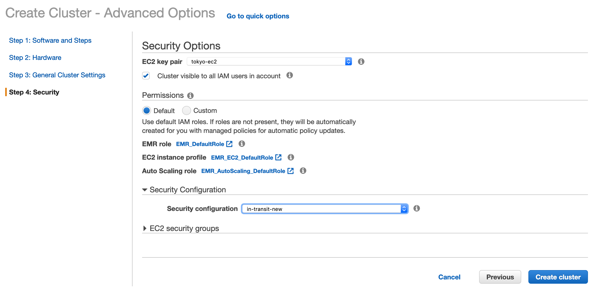

## 五. 为EMR Master安装Ranger Plugin

### 5.1 准备安装包
需要将以下安装包放到S3上，并记录S3的路径，需要在Plugin的安装脚本中指定S3路径

[HDFS Plugin](https://hxh-tokyo.s3-ap-northeast-1.amazonaws.com/ranger/ranger-2.1.0-SNAPSHOT-hdfs-plugin.tar.gz)

[Hive Plugin](https://hxh-tokyo.s3-ap-northeast-1.amazonaws.com/ranger/ranger-2.1.0-SNAPSHOT-hive-plugin.tar.gz)

[Prestodb Plugin](https://hxh-tokyo.s3-ap-northeast-1.amazonaws.com/ranger/ranger-2.1.0-SNAPSHOT-prestodb-plugin-presto232.tar.gz)

[javax.mail-api-1.6.0.jar](https://hxh-tokyo.s3-ap-northeast-1.amazonaws.com/ranger/javax.mail-api-1.6.0.jar)

[rome-0.9.jar](https://hxh-tokyo.s3-ap-northeast-1.amazonaws.com/ranger/rome-0.9.jar)

[jdom-1.1.3.jar](https://hxh-tokyo.s3-ap-northeast-1.amazonaws.com/ranger/jdom-1.1.3.jar)

[mysql-connector-java-5.1.39.jar](https://hxh-tokyo.s3-ap-northeast-1.amazonaws.com/ranger/mysql-connector-java-5.1.39.jar)

### 5.2 安装 Hive Plugin

首先需要将HDFS/Hive安装脚本install-hive-hdfs-ranger-plugin.sh中的s3 bucket路径替换成自己的路径：
```
ranger_s3bucket=s3://hxh-tokyo/ranger
```

然后可以通过Step提交脚本，或者直接登录到EMR Master执行脚本`install-hive-hdfs-ranger-plugin.sh`.

**以通过Step提交脚本为例：脚本文件可以放在S3上，注意需要指定Ranger Server的IP地址作为脚本参数**

```
##运行Shell脚本的JAR包：
s3://elasticmapreduce/libs/script-runner/script-runner.jar

##Step 参数，172.31.43.166为Ranger Admin的IP地址
s3://hxh-tokyo/ranger/install-hive-hdfs-ranger-plugin.sh 172.31.43.166
```

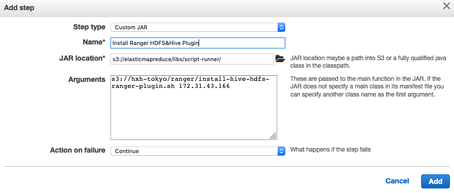


### 5.3 安装 Presto Plugin

首先需要将Presto安装脚本install-presto-ranger-plugin.sh中的s3 bucket路径替换成自己的路径：

```
ranger_s3bucket=s3://hxh-tokyo/ranger
```

然后可以通过Step提交脚本，或者直接登录到EMR Master执行脚本`install-presto-ranger-plugin.s`.

**以通过Step提交脚本为例：脚本文件可以放在S3上，注意需要指定Ranger Server的IP地址作为脚本参数**

```
##运行Shell脚本的JAR包：
s3://elasticmapreduce/libs/script-runner/script-runner.jar

##Step 参数，172.31.43.166为Ranger Admin的IP地址
s3://hxh-tokyo/ranger/install-presto-ranger-plugin.sh 172.31.43.166
```

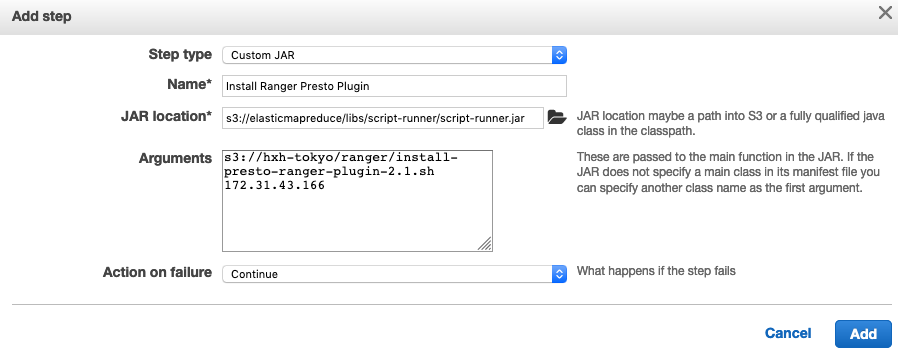


## 六. 配置 Ranger 授权策略

为Ranger配置基于Resource的授权策略，可以通过Ranger Admin的Web UI手动配置，也可以通过脚本的方式，利用Ranger API配置。建议先使用脚本配置初始策略，再通过Ranger UI进行修改。

**示例策略：为用户Hue分配Hive和Presto Metastore中Default数据库的读写权限。**

首先将Ranger Policies的策略文件放到S3上，并记录路径，例如s3://hxh-tokyo/ranger/policies

### 6.1 加载HDFS和Hive策略

首先确认将脚本中的策略文件S3路径，修改为自己的S3路径
```
ranger_policybucket=s3://hxh-tokyo/ranger/policies
```

然后可以通过Step提交脚本，或者直接登录到EMR Master执行脚本`install-hive-hdfs-ranger-policies.sh`.

**以通过Step提交脚本为例：脚本文件可以放在S3上，注意需要指定Ranger Server的IP地址作为脚本参数**

```
##运行Shell脚本的JAR包：
s3://elasticmapreduce/libs/script-runner/script-runner.jar

##Step 参数，172.31.43.166为Ranger Admin的IP地址
s3://hxh-tokyo/ranger/install-hive-hdfs-ranger-policies.sh 172.31.43.166
```

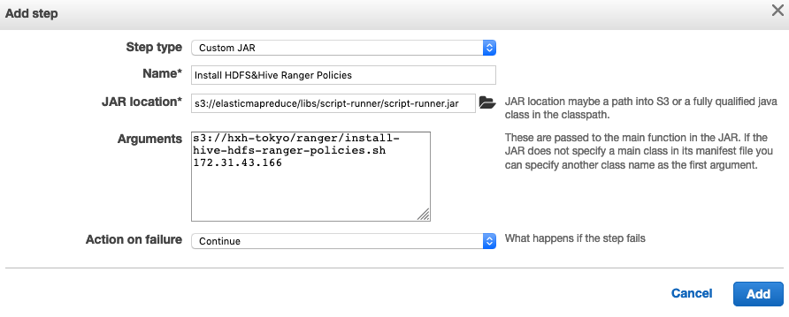


### 6.2 加载Presto策略

首先确认将脚本中的策略文件S3路径，修改为自己的S3路径
```
ranger_policybucket=s3://hxh-tokyo/ranger/policies
```

然后可以通过Step提交脚本，或者直接登录到EMR Master执行脚本`install-presto-ranger-policies.sh`.

**以通过Step提交脚本为例：脚本文件可以放在S3上，注意需要指定Ranger Server的IP地址作为脚本参数**

```
##运行Shell脚本的JAR包：
s3://elasticmapreduce/libs/script-runner/script-runner.jar

##Step 参数，172.31.43.166为Ranger Admin的IP地址
s3://hxh-tokyo/ranger/install-presto-ranger-policies.sh 172.31.43.166
```


## 七. 验证Ranger权限控制


### 登录Ranger Admin UI查看Resource Access policy


1. 查看Hive 策略

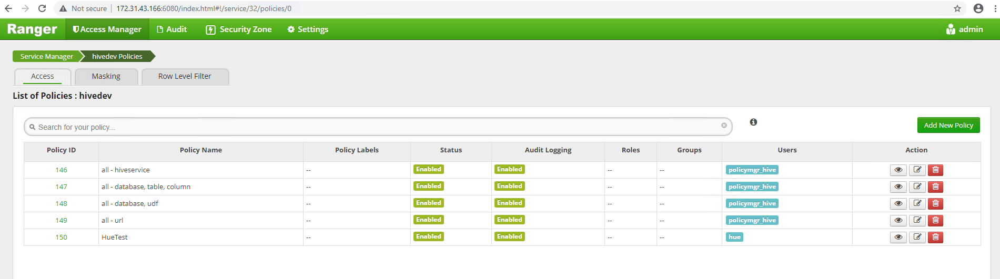

2. 查看Hive的Hue示例策略

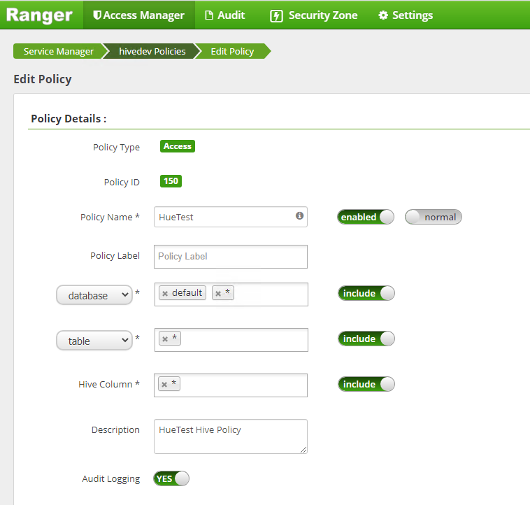

3. 查看Presto 策略

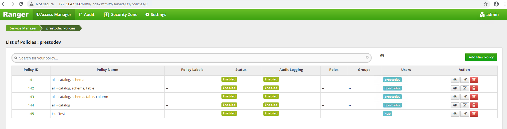

4. 查看Presto的Hue示例策略

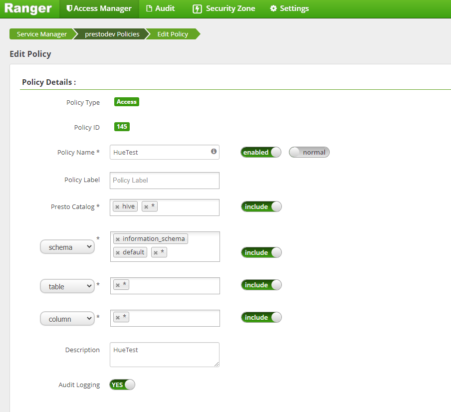


### 登录Hue UI，验证Ranger策略

1. 使用用户名为hue的LDAP用户登录Hue应用，密码为LDAP上的密码

使用Hive应用进行查询

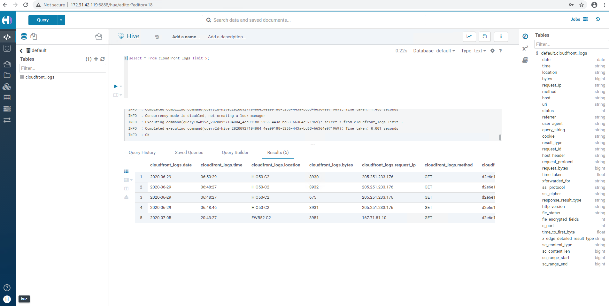

使用Presto应用进行查询

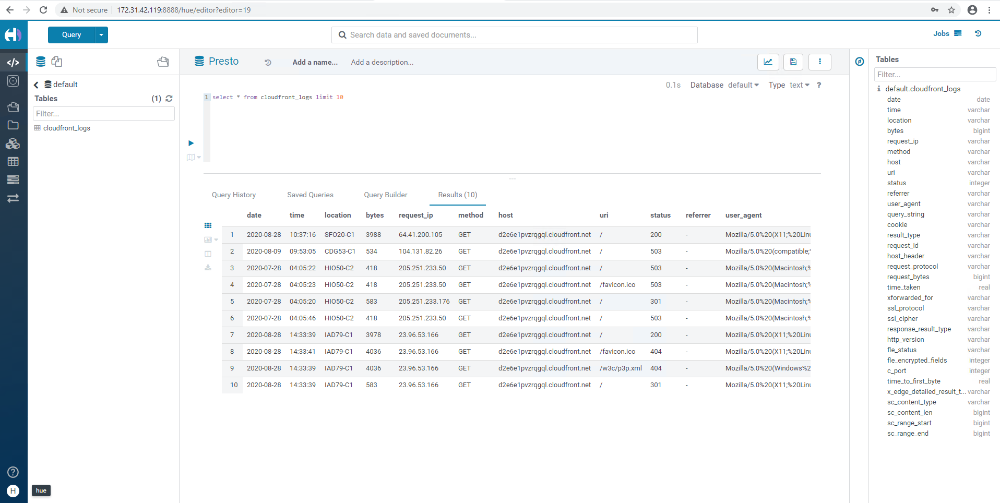

2. 使用用户名为hiveadmin的LDAP用户登录Hue应用，密码为LDAP上的密码

使用Presto应用，提示无权限

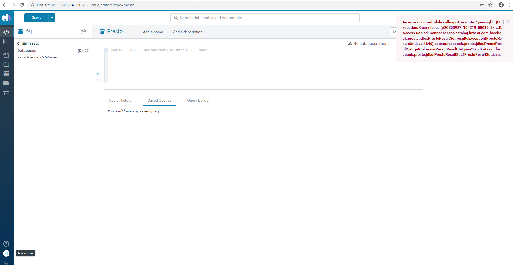

使用Hive应用，提示无权限

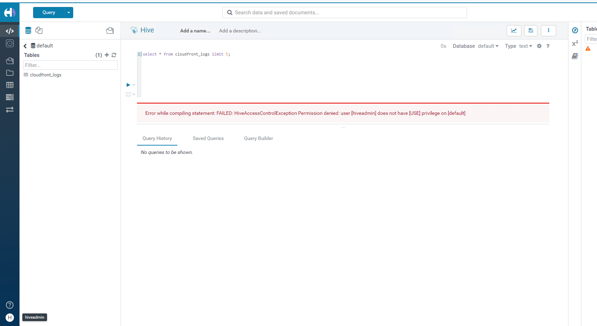

### 登录EMR Master，验证Ranger策略

另外也可以通过在EMR Master上执行命令进行验证

**Hive应用验证**
```
[ec2-user@ip-172-31-42-119 ~]$ beeline -u jdbc:hive2://127.0.0.1:10000 -n hue -p 123456
Connecting to jdbc:hive2://127.0.0.1:10000
Connected to: Apache Hive (version 2.3.6-amzn-2)
Driver: Hive JDBC (version 2.3.6-amzn-2)
Transaction isolation: TRANSACTION_REPEATABLE_READ
Beeline version 2.3.6-amzn-2 by Apache Hive
0: jdbc:hive2://127.0.0.1:10000> show tables;
INFO  : Compiling command(queryId=hive_20200927104906_ac036b3e-8a66-4548-9e16-5ab848a1f068): show tables
INFO  : Semantic Analysis Completed
INFO  : Returning Hive schema: Schema(fieldSchemas:[FieldSchema(name:tab_name, type:string, comment:from deserializer)], properties:null)
INFO  : Completed compiling command(queryId=hive_20200927104906_ac036b3e-8a66-4548-9e16-5ab848a1f068); Time taken: 0.101 seconds
INFO  : Concurrency mode is disabled, not creating a lock manager
INFO  : Executing command(queryId=hive_20200927104906_ac036b3e-8a66-4548-9e16-5ab848a1f068): show tables
INFO  : Starting task [Stage-0:DDL] in serial mode
INFO  : Completed executing command(queryId=hive_20200927104906_ac036b3e-8a66-4548-9e16-5ab848a1f068); Time taken: 0.176 seconds
INFO  : OK
+------------------+
|     tab_name     |
+------------------+
| cloudfront_logs  |
+------------------+
1 row selected (0.35 seconds)
0: jdbc:hive2://127.0.0.1:10000>
[ec2-user@ip-172-31-42-119 ~]$ beeline -u jdbc:hive2://127.0.0.1:10000 -n hiveadmin -p 123456
Connecting to jdbc:hive2://127.0.0.1:10000
Connected to: Apache Hive (version 2.3.6-amzn-2)
Driver: Hive JDBC (version 2.3.6-amzn-2)
Transaction isolation: TRANSACTION_REPEATABLE_READ
Beeline version 2.3.6-amzn-2 by Apache Hive
0: jdbc:hive2://127.0.0.1:10000>
0: jdbc:hive2://127.0.0.1:10000> show tables;
Error: Error while compiling statement: FAILED: HiveAccessControlException Permission denied: user [hiveadmin] does not have [USE] privilege on [default] (state=42000,code=40000)
0: jdbc:hive2://127.0.0.1:10000>
```

**使用Presto应用验证**
```
[ec2-user@ip-172-31-42-119 ~]$ presto-cli --catalog hive --schema default --user hue
presto:default> show tables;
      Table
-----------------
 cloudfront_logs
(1 row)

Query 20200927_105108_00015_8krzd, FINISHED, 3 nodes
Splits: 36 total, 36 done (100.00%)
0:01 [1 rows, 32B] [1 rows/s, 49B/s]

presto:default>
presto:default> exit
[ec2-user@ip-172-31-42-119 ~]$ presto-cli --catalog hive --schema default --user hiveadmin
presto:default> show tables;
Query 20200927_105128_00019_8krzd failed: Access Denied: Cannot access catalog hive

presto:default>
```

**使用Presto用户名+密码认证授权，需要使用HTTPS，且要求在集群启动的时候，已通过Security Configuration中的传输加密配置了证书**
```
[ec2-user@ip-172-31-42-119 ~]$ presto-cli \
> --server https://ip-172-31-42-119.ap-northeast-1.compute.internal:8446  \
> --truststore-path /usr/share/aws/emr/security/conf/truststore.jks \
> --truststore-password ri9waMHRNk \
> --catalog hive \
> --schema default \
> --user hue \
> --password
Password:
presto:default> show tables;
      Table
-----------------
 cloudfront_logs
(1 row)

Query 20200927_105541_00022_8krzd, FINISHED, 3 nodes
Splits: 36 total, 36 done (100.00%)
0:00 [1 rows, 32B] [2 rows/s, 75B/s]

presto:default> exit
[ec2-user@ip-172-31-42-119 ~]$ presto-cli --server https://ip-172-31-42-119.ap-northeast-1.compute.internal:8446  --truststore-path /usr/share/aws/emr/security/conf/truststore.jks --truststore-password ri9waMHRNk --catalog hive --schema default --user hiveadmin --password
Password:
presto:default> show tables;
Query 20200927_105804_00025_8krzd failed: Access Denied: Cannot access catalog hive

presto:default>
```