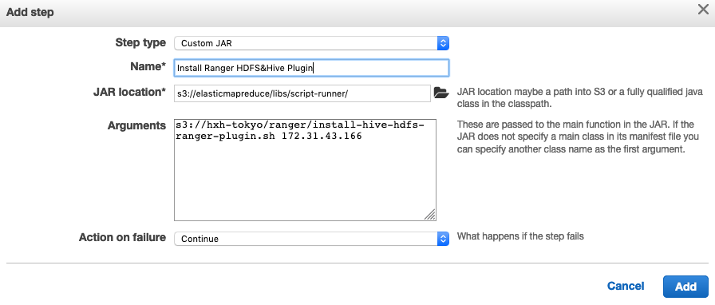
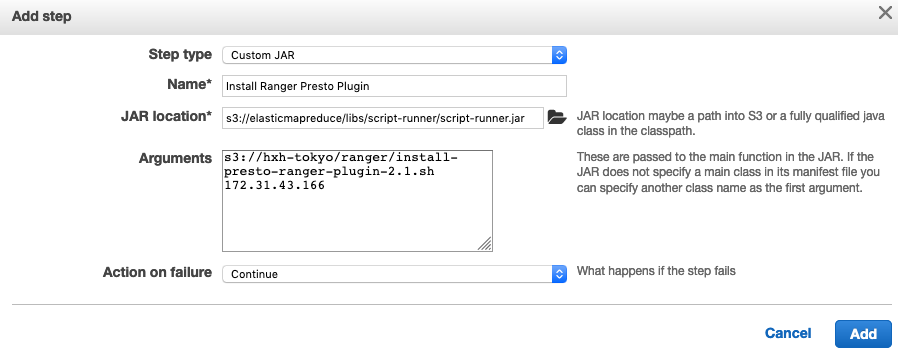
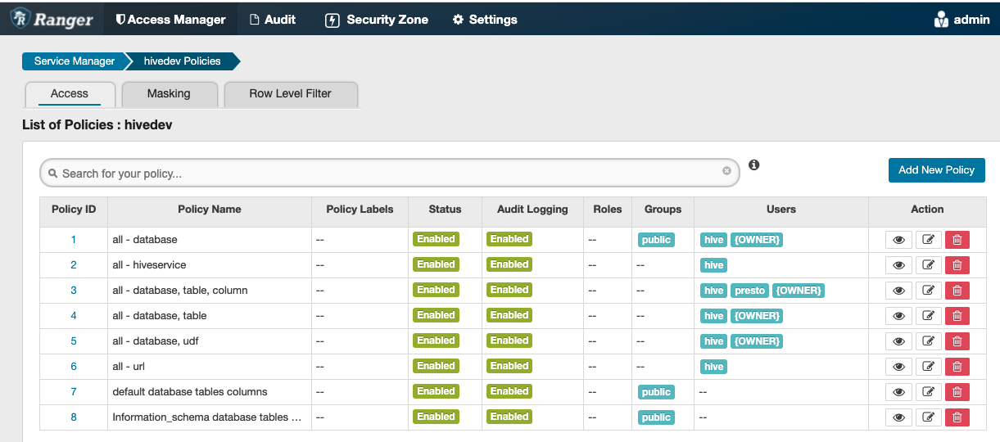

# EMR 6.2 集成 Open SourceApache Ranger 2.1.1

## Table of Contents
========================
 * [说明](#说明)
  * [一. Build Ranger 安装包](#一-Build-Ranger-安装包)
  * [二. 安装 Ranger Server](#二-安装-Ranger-Server)
  * [三. 启动EMR集群](#三-启动EMR集群)
  * [四. 为EMR Master安装Ranger Plugin](#四-为EMR-Master安装Ranger-Plugin)
  * [五. 配置 Ranger 授权策略](#五-配置-Ranger-授权策略)
  * [六. 验证Ranger权限控制](#六-验证Ranger权限控制)

## 说明
将Apache Ranger 2.1.1与Amazon EMR 6.2集成，实现Hive，PrestoSQL应用基于数据库，表，列的权限控制。

**默认Ranger2.1.1支持的Hive版本为3.1.2以上，PrestoSQL版本为333以上，所以不支持EMR 5.x版本，EMR 6.2中Hive版本为3.1.2， PrestoSQL为343，支持Ranger 2.1的要求**

整套环境的组件包括：
 - LDAP Server： 作为访问Hive/Presto的用户的数据库，实现用户登录认证的工作
 - Ranger Admin：管理
   - Policy Manager: 负责对Hive/Presto基于数据库，表和列级别的授权
   - User Sync：负责与LDAP Server同步用户
   - Solr Audit：负责用户访问Hive/Presto应用的行为审计，包括读写，查询等，以及RangerAdmin登录
   - Plugin：安装在EMR Master上，与Hive和Presto Server集成，拦截用户与Hive/presto之间的交互，并基于Ranger policymanager进行授权


## 一. Build Ranger 安装包

1. 安装Build所需的包
```
#set -euo pipefail
#set -x
sudo yum -y install java-1.8.0
sudo yum install java-1.8.0-openjdk-devel.x86_64 -y

sudo yum -y remove java-1.7.0-openjdk

sudo yum install git -y
sudo yum install python3 -y
sudo pip3 install requests -y 
sudo yum install gcc g++ -y
```

2. Build Ranger
```
#git clone https://github.com/apache/ranger ##这是下载最新版本，目前是3.0.0-snapshot
## 获取2.1版本的Apache Ranger
git clone https://github.com/apache/ranger -b ranger-2.1 

##需要mvn 3.6.3, python3, requests(pip3)
wget https://mirrors.tuna.tsinghua.edu.cn/apache/maven/maven-3/3.6.3/binaries/apache-maven-3.6.3-bin.tar.gz

##Download and Setup maven
sudo tar xf apache-maven-3.6.3-bin.tar.gz -C /opt
sudo su
export PATH=/opt/apache-maven-3.6.3/bin:$PATH
export MAVEN_OPTS=-Xmx2048m

##需要通过ls -l /etc/alternatives/java 查找JAVA HOME
export JAVA_HOME=/usr/lib/jvm/java-1.8.0-openjdk-1.8.0.265.b01-1.amzn2.0.1.x86_64
export PATH=$JAVA_HOME/bin:$PATH

## Start to build
cd apache-ranger-2.1.1

##可以在根目录下的pom.xml文件中查看Ranger对Maven，以及对各个Hadoop生态应用要求的版本
<artifactId>ranger</artifactId>
<version>2.1.1-SNAPSHOT</version>
<description>Security for Enforcing Enterprise Policies</description>
<maven.version.required>3.6.2</maven.version.required>
<hive.version>3.1.2</hive.version>
<presto.version>333</presto.version>


## 开始build
sudo mvn -DskipTests=false clean compile package install assembly:assembly 

[INFO] Reactor Summary for ranger 2.1.1-SNAPSHOT:
[INFO]
[INFO] ranger ............................................. SUCCESS [  3.956 s]
[INFO] Jdbc SQL Connector ................................. SUCCESS [  1.601 s]
[INFO] Credential Support ................................. SUCCESS [  3.410 s]
[INFO] Audit Component .................................... SUCCESS [  3.774 s]
[INFO] ranger-plugin-classloader .......................... SUCCESS [  1.382 s]
[INFO] Common library for Plugins ......................... SUCCESS [  9.625 s]
[INFO] ranger-intg ........................................ SUCCESS [  4.059 s]
[INFO] Installer Support Component ........................ SUCCESS [  0.573 s]
[INFO] Credential Builder ................................. SUCCESS [ 10.497 s]
[INFO] Embedded Web Server Invoker ........................ SUCCESS [ 25.249 s]
[INFO] Key Management Service ............................. SUCCESS [15:12 min]
[INFO] HBase Security Plugin Shim ......................... SUCCESS [07:51 min]
[INFO] HBase Security Plugin .............................. SUCCESS [02:24 min]
[INFO] Hdfs Security Plugin ............................... SUCCESS [ 21.706 s]
[INFO] Hive Security Plugin ............................... SUCCESS [13:08 min]
[INFO] Knox Security Plugin Shim .......................... SUCCESS [01:40 min]
[INFO] Knox Security Plugin ............................... SUCCESS [07:41 min]
[INFO] Storm Security Plugin .............................. SUCCESS [ 54.847 s]
[INFO] YARN Security Plugin ............................... SUCCESS [  1.832 s]
[INFO] Ozone Security Plugin .............................. SUCCESS [02:50 min]
[INFO] Ranger Util ........................................ SUCCESS [  4.030 s]
[INFO] Unix Authentication Client ......................... SUCCESS [  6.559 s]
[INFO] Security Admin Web Application ..................... SUCCESS [06:10 min]
[INFO] KAFKA Security Plugin .............................. SUCCESS [01:31 min]
[INFO] SOLR Security Plugin ............................... SUCCESS [03:21 min]
[INFO] NiFi Security Plugin ............................... SUCCESS [  3.241 s]
[INFO] NiFi Registry Security Plugin ...................... SUCCESS [  3.352 s]
[INFO] Kudu Security Plugin ............................... SUCCESS [  1.268 s]
[INFO] Unix User Group Synchronizer ....................... SUCCESS [03:37 min]
[INFO] Ldap Config Check Tool ............................. SUCCESS [  0.804 s]
[INFO] Unix Authentication Service ........................ SUCCESS [  1.425 s]
[INFO] Unix Native Authenticator .......................... SUCCESS [  1.234 s]
[INFO] KMS Security Plugin ................................ SUCCESS [  5.997 s]
[INFO] Tag Synchronizer ................................... SUCCESS [01:45 min]
[INFO] Hdfs Security Plugin Shim .......................... SUCCESS [  1.376 s]
[INFO] Hive Security Plugin Shim .......................... SUCCESS [ 16.790 s]
[INFO] YARN Security Plugin Shim .......................... SUCCESS [  1.390 s]
[INFO] OZONE Security Plugin Shim ......................... SUCCESS [  1.462 s]
[INFO] Storm Security Plugin shim ......................... SUCCESS [  5.765 s]
[INFO] KAFKA Security Plugin Shim ......................... SUCCESS [  1.420 s]
[INFO] SOLR Security Plugin Shim .......................... SUCCESS [  1.772 s]
[INFO] Atlas Security Plugin Shim ......................... SUCCESS [ 10.690 s]
[INFO] KMS Security Plugin Shim ........................... SUCCESS [  1.704 s]
[INFO] ranger-examples .................................... SUCCESS [  0.074 s]
[INFO] Ranger Examples - Conditions and ContextEnrichers .. SUCCESS [  2.854 s]
[INFO] Ranger Examples - SampleApp ........................ SUCCESS [  0.461 s]
[INFO] Ranger Examples - Ranger Plugin for SampleApp ...... SUCCESS [  1.237 s]
[INFO] sample-client ...................................... SUCCESS [  1.369 s]
[INFO] Apache Ranger Examples Distribution ................ SUCCESS [ 12.675 s]
[INFO] Ranger Tools ....................................... SUCCESS [ 22.239 s]
[INFO] Atlas Security Plugin .............................. SUCCESS [  1.720 s]
[INFO] SchemaRegistry Security Plugin ..................... SUCCESS [10:13 min]
[INFO] Sqoop Security Plugin .............................. SUCCESS [ 25.396 s]
[INFO] Sqoop Security Plugin Shim ......................... SUCCESS [  1.294 s]
[INFO] Kylin Security Plugin .............................. SUCCESS [04:31 min]
[INFO] Kylin Security Plugin Shim ......................... SUCCESS [  6.592 s]
[INFO] Presto Security Plugin ............................. SUCCESS [ 28.368 s]
[INFO] Presto Security Plugin Shim ........................ SUCCESS [01:03 min]
[INFO] Elasticsearch Security Plugin Shim ................. SUCCESS [  3.357 s]
[INFO] Elasticsearch Security Plugin ...................... SUCCESS [  1.505 s]
[INFO] Apache Ranger Distribution ......................... SUCCESS [01:20 min]
[INFO] ------------------------------------------------------------------------
[INFO] BUILD SUCCESS
[INFO] ------------------------------------------------------------------------
[INFO] Total time:  01:29 h
[INFO] Finished at: 2021-08-02T08:59:53Z
[INFO] ------------------------------------------------------------------------


[ec2-user@ip-172-31-32-198 ranger]$ cd target/
[ec2-user@ip-172-31-32-198 target]$ ls -l
total 1126096
drwxr-xr-x 2 root root        28 Aug  2 07:30 antrun
-rw-r--r-- 1 root root        87 Aug  2 07:30 checkstyle-cachefile
-rw-r--r-- 1 root root      9216 Aug  2 07:30 checkstyle-checker.xml
-rw-r--r-- 1 root root     20369 Aug  2 07:30 checkstyle-header.txt
-rw-r--r-- 1 root root        81 Aug  2 07:30 checkstyle-result.xml
-rw-r--r-- 1 root root      1144 Aug  2 07:30 checkstyle-suppressions.xml
drwxr-xr-x 3 root root        22 Aug  2 07:30 maven-shared-archive-resources
-rw-r--r-- 1 root root 295284628 Aug  2 08:59 ranger-2.1.1-SNAPSHOT-admin.tar.gz
-rw-r--r-- 1 root root  48979977 Aug  2 08:59 ranger-2.1.1-SNAPSHOT-atlas-plugin.tar.gz
-rw-r--r-- 1 root root  31720958 Aug  2 08:59 ranger-2.1.1-SNAPSHOT-elasticsearch-plugin.tar.gz
-rw-r--r-- 1 root root  43395251 Aug  2 08:59 ranger-2.1.1-SNAPSHOT-hbase-plugin.tar.gz
-rw-r--r-- 1 root root  41976905 Aug  2 08:59 ranger-2.1.1-SNAPSHOT-hdfs-plugin.tar.gz
-rw-r--r-- 1 root root  41767106 Aug  2 08:59 ranger-2.1.1-SNAPSHOT-hive-plugin.tar.gz
-rw-r--r-- 1 root root  58733410 Aug  2 08:59 ranger-2.1.1-SNAPSHOT-kafka-plugin.tar.gz
-rw-r--r-- 1 root root 134708559 Aug  2 08:59 ranger-2.1.1-SNAPSHOT-kms.tar.gz
-rw-r--r-- 1 root root  46125529 Aug  2 08:59 ranger-2.1.1-SNAPSHOT-knox-plugin.tar.gz
-rw-r--r-- 1 root root  41687219 Aug  2 08:59 ranger-2.1.1-SNAPSHOT-kylin-plugin.tar.gz
-rw-r--r-- 1 root root     34449 Aug  2 08:59 ranger-2.1.1-SNAPSHOT-migration-util.tar.gz
-rw-r--r-- 1 root root  48390956 Aug  2 08:59 ranger-2.1.1-SNAPSHOT-ozone-plugin.tar.gz
-rw-r--r-- 1 root root  61122444 Aug  2 08:59 ranger-2.1.1-SNAPSHOT-presto-plugin.tar.gz
-rw-r--r-- 1 root root  19849765 Aug  2 08:59 ranger-2.1.1-SNAPSHOT-ranger-tools.tar.gz
-rw-r--r-- 1 root root   1390405 Aug  2 08:59 ranger-2.1.1-SNAPSHOT-schema-registry-plugin.jar
-rw-r--r-- 1 root root     36936 Aug  2 08:59 ranger-2.1.1-SNAPSHOT-solr_audit_conf.tar.gz
-rw-r--r-- 1 root root  41369532 Aug  2 08:59 ranger-2.1.1-SNAPSHOT-solr-plugin.tar.gz
-rw-r--r-- 1 root root  41898303 Aug  2 08:59 ranger-2.1.1-SNAPSHOT-sqoop-plugin.tar.gz
-rw-r--r-- 1 root root   4462494 Aug  2 08:59 ranger-2.1.1-SNAPSHOT-src.tar.gz
-rw-r--r-- 1 root root  54982904 Aug  2 08:59 ranger-2.1.1-SNAPSHOT-storm-plugin.tar.gz
-rw-r--r-- 1 root root  35680542 Aug  2 08:59 ranger-2.1.1-SNAPSHOT-tagsync.tar.gz
-rw-r--r-- 1 root root  17328102 Aug  2 08:59 ranger-2.1.1-SNAPSHOT-usersync.tar.gz
-rw-r--r-- 1 root root  41902620 Aug  2 08:59 ranger-2.1.1-SNAPSHOT-yarn-plugin.tar.gz
-rw-r--r-- 1 root root    182528 Aug  2 07:30 rat.txt
-rw-r--r-- 1 root root        14 Aug  2 07:30 version
[ec2-user@ip-172-31-32-198 target]$

```
## 二. 安装 Ranger Server

**可以登录到Ranger Server，直接运行install-ranger-admin-server.sh脚本**

如果需要手动一步步安装，请参考以下步骤

1. 设置环境变量
```
sudo su
hostip=`hostname -I | xargs`
installpath=/usr/lib/ranger
mysql_jar=mysql-connector-java-5.1.39.jar
ranger_admin=ranger-2.1.1-SNAPSHOT-admin  
ranger_user_sync=ranger-2.1.1-SNAPSHOT-usersync
ldap_domain=ap-northeast-1.compute.internal                                 
ldap_server_url=ldap://ip-172-31-36-146.ap-northeast-1.compute.internal:389                   
ldap_base_dn=dc=ap-northeast-1,dc=compute,dc=internal                  
ldap_bind_user_dn=uid=hive,dc=ap-northeast-1,dc=compute,dc=internal   
ldap_bind_password=123456                                 
# ranger_s3bucket=https://hxh-tokyo.s3-ap-northeast-1.amazonaws.com/ranger
ranger_s3bucket=s3://hxh-tokyo/ranger
```

2. 安装
```
yum install -y openldap openldap-clients openldap-servers

sudo mkdir -p $installpath
cd $installpath

# wget $ranger_s3bucket/$ranger_admin.tar.gz
# wget $ranger_s3bucket/$ranger_user_sync.tar.gz
# wget $ranger_s3bucket/$mysql_jar
# wget $ranger_s3bucket/solr_for_audit_setup.tar.gz

aws s3 cp $ranger_s3bucke/$ranger_admin.tar.gz .
aws s3 cp $ranger_s3bucke/$ranger_user_sync.tar.gz .
aws s3 cp $ranger_s3bucke/$mysql_jar .
aws s3 cp $ranger_s3bucke/solr_for_audit_setup.tar.gz .
 .
sudo tar xvpfz $ranger_admin.tar.gz -C $installpath
sudo tar xvpfz $ranger_user_sync.tar.gz -C $installpath
# cp $mysql_jar $installpath
# cd $installpath

##### 安装 MySQL，用作Ranger数据库
#yum -y install mysql-server
#service mysqld start
#chkconfig mysqld on
yum -y install mariadb-server
service mariadb start
chkconfig mariadb on
mysqladmin -u root password rangeradmin || true
mysql -u root -prangeradmin -e "CREATE USER 'rangeradmin'@'localhost' IDENTIFIED BY 'rangeradmin';" || true
mysql -u root -prangeradmin -e "create database ranger;" || true
mysql -u root -prangeradmin -e "GRANT ALL PRIVILEGES ON *.* TO 'rangeradmin'@'localhost' IDENTIFIED BY 'rangeradmin'" || true
mysql -u root -prangeradmin -e "FLUSH PRIVILEGES;" || true


##### 安装Ranger admin
sudo ln -s $ranger_admin ranger-admin
cd $installpath/ranger-admin
sudo cp install.properties install.properties_original
#sudo sed -i "s|#setup_mode=SeparateDBA|setup_mode=SeparateDBA|g" install.properties
sudo sed -i "s|SQL_CONNECTOR_JAR=.*|SQL_CONNECTOR_JAR=$installpath/$mysql_jar|g" install.properties
#sudo sed -i "s|db_host=.*|db_host=$db_host|g" install.properties
#sudo sed -i "s|db_root_user=.*|db_root_user=ranger|g" install.properties
sudo sed -i "s|db_root_password=.*|db_root_password=rangeradmin|g" install.properties
#sudo sed -i "s|db_user=.*|db_user=ranger|g" install.properties
sudo sed -i "s|db_password=.*|db_password=rangeradmin|g" install.properties
#sudo sed -i "s|db_name=.*|db_name=ranger_2_0|g" install.properties
sudo sed -i "s|policymgr_external_url=.*|policymgr_external_url=http://$hostip:6080|g" install.properties
sudo sed -i "s|rangerAdmin_password=.*|rangerAdmin_password=1qazxsw2|g" install.properties
sudo sed -i "s|rangerTagsync_password=.*|rangerTagsync_password=1qazxsw2|g" install.properties
sudo sed -i "s|rangerUsersync_password=.*|rangerUsersync_password=1qazxsw2|g" install.properties
sudo sed -i "s|keyadmin_password=.*|keyadmin_password=1qazxsw2|g" install.properties
#Update audit properties
sudo sed -i "s|audit_db_password=.*|audit_db_password=rangerlogger|g" install.properties
sudo sed -i "s|audit_store=.*|audit_store=solr|g" install.properties
sudo sed -i "s|audit_solr_urls=.*|audit_solr_urls=http://$hostip:8983/solr/ranger_audits|g" install.properties

### 为Ranger admin配置连接LDAP server的参数
sudo sed -i "s|authentication_method=.*|authentication_method=LDAP|g" install.properties
sudo sed -i "s|xa_ldap_url=.*|xa_ldap_url=$ldap_server_url|g" install.properties
sudo sed -i "s|xa_ldap_userDNpattern=.*|xa_ldap_userDNpattern=uid={0},$ldap_base_dn|g" install.properties
sudo sed -i "s|xa_ldap_groupSearchBase=.*|xa_ldap_groupSearchBase=$ldap_base_dn|g" install.properties
sudo sed -i "s|xa_ldap_groupSearchFilter=.*|xa_ldap_groupSearchFilter=(member=uid={0},$ldap_base_dn)|g" install.properties
sudo sed -i "s|xa_ldap_groupRoleAttribute=.*|xa_ldap_groupRoleAttribute=cn|g" install.properties
sudo sed -i "s|xa_ldap_base_dn=.*|xa_ldap_base_dn=$ldap_base_dn|g" install.properties
sudo sed -i "s|xa_ldap_bind_dn=.*|xa_ldap_bind_dn=$ldap_bind_user_dn|g" install.properties
sudo sed -i "s|xa_ldap_bind_password=.*|xa_ldap_bind_password=$ldap_bind_password|g" install.properties
sudo sed -i "s|xa_ldap_referral=.*|xa_ldap_referral=ignore|g" install.properties
sudo sed -i "s|xa_ldap_userSearchFilter=.*|xa_ldap_userSearchFilter=(uid={0})|g" install.properties
sudo chmod +x setup.sh
sudo ./setup.sh

##### 安装Ranger user sync组件
cd $installpath
sudo ln -s $ranger_user_sync ranger-usersync
cd $installpath/ranger-usersync
sudo cp install.properties install.properties_original
sudo sed -i "s|POLICY_MGR_URL =.*|POLICY_MGR_URL=http://$hostip:6080|g" install.properties
sudo sed -i "s|SYNC_SOURCE =.*|SYNC_SOURCE=ldap|g" install.properties
sudo sed -i "s|SYNC_LDAP_URL =.*|SYNC_LDAP_URL=$ldap_server_url|g" install.properties
sudo sed -i "s|SYNC_LDAP_BIND_DN =.*|SYNC_LDAP_BIND_DN=$ldap_bind_user_dn|g" install.properties
sudo sed -i "s|SYNC_LDAP_BIND_PASSWORD =.*|SYNC_LDAP_BIND_PASSWORD=123456|g" install.properties
sudo sed -i "s|SYNC_LDAP_SEARCH_BASE =.*|SYNC_LDAP_SEARCH_BASE=$ldap_base_dn|g" install.properties
sudo sed -i "s|SYNC_LDAP_USER_SEARCH_BASE =.*|SYNC_LDAP_USER_SEARCH_BASE=$ldap_base_dn|g" install.properties
sudo sed -i "s|SYNC_LDAP_USER_OBJECT_CLASS =.*|SYNC_LDAP_USER_OBJECT_CLASS=inetOrgPerson|g" install.properties
sudo sed -i "s|SYNC_LDAP_USER_SEARCH_FILTER =.*|SYNC_LDAP_USER_SEARCH_FILTER=objectclass=inetOrgPerson|g" install.properties
sudo sed -i "s|SYNC_LDAP_USER_NAME_ATTRIBUTE =.*|SYNC_LDAP_USER_NAME_ATTRIBUTE=uid|g" install.properties
sudo sed -i "s|SYNC_GROUP_SEARCH_ENABLED=.*|SYNC_GROUP_SEARCH_ENABLED=true|g" install.properties
sudo sed -i "s|SYNC_INTERVAL =.*|SYNC_INTERVAL=30|g" install.properties
sudo sed -i "s|rangerUsersync_password=.*|rangerUsersync_password=1qazxsw2|g" install.properties
sudo sed -i "s|SYNC_LDAP_DELTASYNC =.*|SYNC_LDAP_DELTASYNC=true|g" install.properties
sudo sed -i "s|logdir=logs|logdir=/var/log/ranger/usersync|g" install.properties
sudo chmod +x setup.sh
sudo -E ./setup.sh

###### 安装Ranger Solr组件，用于审计
## need to manually down solr from URL, and decompress to /opt/solr
cd $installpath
wget http://archive.apache.org/dist/lucene/solr/5.2.1/solr-5.2.1.tgz
sudo tar -xvf solr-5.2.1.tgz -C /opt/
sudo mv /opt/solr-5.2.1 /opt/solr
sudo tar -xvf solr_for_audit_setup.tar.gz
cd solr_for_audit_setup
sudo sed -i "s|#JAVA_HOME=.*|JAVA_HOME=/usr/lib/jvm/jre-1.8.0-openjdk-1.8.0.282.b08-1.amzn2.0.1.x86_64|g" install.properties
sudo sed -i "s|SOLR_INSTALL=.*|SOLR_INSTALLL=true|g" install.properties
sudo sed -i "s|SOLR_DOWNLOAD_URL=.*|SOLR_DOWNLOAD_URL=http://archive.apache.org/dist/lucene/solr/5.2.1/solr-5.2.1.tgz|g" install.properties
sudo sed -i "s|SOLR_HOST_URL=.*|SOLR_HOST_URL=http://$hostip:8983|g" install.properties
sudo sed -i "s|SOLR_RANGER_PORT=.*|SOLR_RANGER_PORT=8983|g" install.properties
sudo chmod +x setup.sh
sudo -E ./setup.sh


# #Change password
# Change rangerusersync user password in Ranger Admin Console, then Execute:
# sudo -E python ./updatepolicymgrpassword.sh

##### Start Ranger Admin 
sudo /usr/bin/ranger-admin stop
sudo /usr/bin/ranger-admin start

##### Start Ranger Usersync 
sudo /usr/bin/ranger-usersync stop
sudo /usr/bin/ranger-usersync start

##### Start Ranger Audit 
# /opt/solr/ranger_audit_server/scripts/stop_solr.sh
sudo /opt/solr/ranger_audit_server/scripts/start_solr.sh
```

通过浏览器打开http://ranger-server:6080 验证ranger是否安装成功，默认用户名密码为admin/admin，如果在配置中修改了默认密码，请使用配置中的密码登录。


## 三. 启动EMR集群

启动EMR集群，选择Advanced Option
- 选择EMR 6.2版本，Hadoop，Hive，Hue，Spark，Presto
- 使用Glue作为Hive，Presto和Spark的Metadata
- 指定EMR Launch Configuration，包括Hue的LDAP配置，External Database，以及Metastore的配置

- 为EMR集群指定EC2 Key Pair，另外Presto如果使用用户名和密码认证，则要求使用https，所以需要在Security Configuration中指定证书（Security Configuration需要提前配置，具体参考官方文档）


EMR Configuration

! 注意Presto的classification为```prestosql```, 另外，需要在hue配置为，为hive添加```beeswax```连接LDAP的配置，以及为presto解析器的连接方式从默认的```jdbc```改为```presto```.
```
[
  {
    "Classification": "prestosql-config",
    "Properties": {
      "http-server.authentication.type": "PASSWORD"
    }
  },
  {
    "Classification": "prestosql-password-authenticator",
    "Properties": {
      "password-authenticator.name": "ldap",
      "ldap.url": "ldaps://ip-172-31-36-146.ap-northeast-1.compute.internal:636",
      "ldap.user-bind-pattern": "uid=${USER},dc=ap-northeast-1,dc=compute,dc=internal"
    }
  },
  {
    "Classification": "oozie-site",
    "Properties": {
      "oozie.service.JPAService.jdbc.driver": "com.mysql.jdbc.Driver",
      "oozie.service.JPAService.jdbc.url": "jdbc:mysql://test1.cluster-cluqkc7jqkna.ap-northeast-1.rds.amazonaws.com:3306/oozie",
      "oozie.service.JPAService.jdbc.username": "admin",
      "oozie.service.JPAService.jdbc.password": "xxxxxx"
    },
    "Configurations": []
  },
  {
    "Classification": "spark-hive-site",
    "Properties": {
      "hive.metastore.client.factory.class": "com.amazonaws.glue.catalog.metastore.AWSGlueDataCatalogHiveClientFactory"
    }
  },
  {
    "Classification": "prestosql-connector-hive",
    "Properties": {
      "hive.metastore": "glue"
    }
  },
  {
    "Classification": "hive-site",
    "Properties": {
      "hive.metastore.client.factory.class": "com.amazonaws.glue.catalog.metastore.AWSGlueDataCatalogHiveClientFactory",
      "hive.server2.authentication": "LDAP",
      "hive.server2.authentication.ldap.url": "ldap://ip-172-31-36-146.ap-northeast-1.compute.internal:389",
      "hive.server2.authentication.ldap.baseDN": "dc=ap-northeast-1,dc=compute,dc=internal"
    }
  },
  {
    "Classification": "hue-ini",
    "Properties": {},
    "Configurations": [
      {
        "Classification": "beeswax",
        "Properties": {
          "auth_username": "hive",
          "auth_password": "xxxxxx"
        },
        "Configurations": []
      },
      {
        "Classification": "notebook",
        "Properties": {},
        "Configurations": [
          {
            "Classification": "interpreters",
            "Properties": {},
            "Configurations": [
              {
                "Classification": "presto",
                "Properties": {
                  "interface": "presto"
                }
              }
            ]
          }
        ]
      },
      {
        "Classification": "desktop",
        "Properties": {},
        "Configurations": [
          {
            "Classification": "database",
            "Properties": {
              "name": "hue",
              "user": "admin",
              "password": "xxxxxx",
              "host": "test1.cluster-cluqkc7jqkna.ap-northeast-1.rds.amazonaws.com",
              "port": "3306",
              "engine": "mysql"
            },
            "Configurations": []
          },
          {
            "Classification": "ldap",
            "Properties": {},
            "Configurations": [
              {
                "Classification": "ldap_servers",
                "Properties": {},
                "Configurations": [
                  {
                    "Classification": "ldap-hue",
                    "Properties": {
                      "base_dn": "dc=ap-northeast-1,dc=compute,dc=internal",
                      "ldap_url": "ldap://ip-172-31-36-146.ap-northeast-1.compute.internal",
                      "search_bind_authentication": "false",
                      "ldap_username_pattern": "uid=<username>,dc=ap-northeast-1,dc=compute,dc=internal",
                      "bind_dn": "uid=hive,dc=ap-northeast-1,dc=compute,dc=internal",
                      "bind_password": "xxxxxx"
                    },
                    "Configurations": [
                      {
                        "classification": "groups",
                        "properties": {
                          "group_filter": "objectclass=groupOfNames",
                          "group_name_attr": "cn"
                        },
                        "configurations": []
                      },
                      {
                        "classification": "users",
                        "properties": {
                          "user_name_attr": "uid",
                          "user_filter": "objectclass=inetOrgPerson"
                        },
                        "configurations": []
                      }
                    ]
                  }
                ]
              }
            ]
          },
          {
            "Classification": "auth",
            "Properties": {
              "backend": "desktop.auth.backend.LdapBackend"
            }
          }
        ]
      }
    ]
  }
]
```

## 四. 为EMR Master安装Ranger Plugin

### 4.1 准备安装包
需要将以下安装包放到S3上，并记录S3的路径，需要在Plugin的安装脚本中指定S3路径

[HDFS Plugin 2.1.1](https://hxh-tokyo.s3-ap-northeast-1.amazonaws.com/ranger/ranger-2.1.1-SNAPSHOT-hdfs-plugin.tar.gz)

[Hive Plugin 2.1.1](https://hxh-tokyo.s3-ap-northeast-1.amazonaws.com/ranger/ranger-2.1.1-SNAPSHOT-hive-plugin.tar.gz)

[PrestoSQL Plugin 2.1.1](https://hxh-tokyo.s3-ap-northeast-1.amazonaws.com/ranger/ranger-2.1.1-SNAPSHOT-presto-plugin.tar.gz)

[javax.mail-api-1.6.0.jar](https://hxh-tokyo.s3-ap-northeast-1.amazonaws.com/ranger/javax.mail-api-1.6.0.jar)

[rome-0.9.jar](https://hxh-tokyo.s3-ap-northeast-1.amazonaws.com/ranger/rome-0.9.jar)

[jdom-1.1.3.jar](https://hxh-tokyo.s3-ap-northeast-1.amazonaws.com/ranger/jdom-1.1.3.jar)

[mysql-connector-java-5.1.39.jar](https://hxh-tokyo.s3-ap-northeast-1.amazonaws.com/ranger/mysql-connector-java-5.1.39.jar)

### 4.2 安装 Hive Plugin

如果是 Multi master EMR集群，需要在每个master节点上，安装 Hive Ranger plugin。

可以通过Step提交脚本，或者直接登录到EMR Master执行脚本，注意需要指定Ranger Server的IP地址作为脚本参数`install-hive-hdfs-ranger-plugin-2-1-1.sh`.

```
[ec2-user@ip-172-31-44-110 ~]$ ./install-hive-hdfs-ranger-plugin-2-1-1.sh 172.31.32.198

```

**通过Step提交脚本：脚本文件可以放在S3上，注意需要指定Ranger Server的IP地址作为脚本参数**

```
##运行Shell脚本的JAR包：
s3://elasticmapreduce/libs/script-runner/script-runner.jar

##Step 参数，172.31.43.166为Ranger Admin的IP地址
s3://hxh-tokyo/ranger/install-hive-hdfs-ranger-plugin-2-1-1 172.31.32.198
```



**!! 注意：相比与EMR 5.x，EMR 6.x的Hue配置中，需要为Hive配置LDAP连接，修改```/etc/hue/conf/hue.ini```，在[beeswax]中添加LDAP的 Auth_username 和 Auth_password，否则使用LDAP登录HUE后，连接Hive会报错。**

如果在创建集群时，已经在 EMR Configuration 中，为 hue 添加相应的 classificiation (beeswax)，则会自动修改此配置。
```
###########################################################################
# Settings to configure Beeswax with Hive
###########################################################################

[beeswax]
  # Override the default desktop username and password of the hue user used for authentications with other services.
  # e.g. Used for LDAP/PAM pass-through authentication.
  auth_username=hive
  auth_password=xxxxxx
```

### 4.3 安装 Presto Plugin

如果是 Multi master EMR集群，只有一台Master运行Presto-server，需要在Presto-server节点上，安装 Presto Ranger plugin，可通过查看Presto配置中 ```/etc/presto/conf/config.properties``` 的discovery.uri来确认哪台是Presto-server
```
[ec2-user@ip-172-31-44-110 ~]$ sudo more /etc/presto/conf/config.properties
coordinator=true
node-scheduler.include-coordinator=false
discovery.uri=https://ip-172-31-44-110.ap-northeast-1.compute.internal:8446
http-server.threads.max=500
discovery-server.enabled=true
sink.max-buffer-size=1GB
query.max-memory=4915MB
query.max-memory-per-node=6532645258B
query.max-total-memory-per-node=7839174309B
query.max-history=40
query.min-expire-age=30m
query.client.timeout=30m
query.stage-count-warning-threshold=100
query.max-stage-count=150
http-server.http.port=8889
http-server.log.path=/var/log/presto/http-request.log
http-server.log.max-size=67108864B
http-server.log.max-history=5
log.max-size=268435456B
log.max-history=5
jmx.rmiregistry.port = 9080
jmx.rmiserver.port = 9081
node.internal-address = ip-172-31-44-110.ap-northeast-1.compute.internal
http-server.https.enabled = true
http-server.https.port = 8446
http-server.authentication.type = PASSWORD
internal-communication.shared-secret = jM5Mj/ICJ3yP2prWHpU/DX08f6aY9jSAtLdEADX9618SSJdmNXtiL62Hj05GTdQNYMDIzgjlPnynmpKm2dN3sA==
internal-communication.https.truststore.key = N7dsBYydrw
internal-communication.https.truststore.path = /usr/share/aws/emr/security/conf/truststore.jks
internal-communication.https.required = true
http-server.http.enabled = true
http-server.https.keystore.path = /usr/share/aws/emr/security/conf/keystore.jks
http-server.https.keystore.key = pHEbBeMkTU
http-server.https.keymanager.password = HI5yGgRL3b
```
Multi Master集群中各个节点的Presto通信是利用HTTPS协议8446端口和共享密钥进行通信，且默认关闭HTTP协议8889端口。

可以通过Step提交脚本，或者直接登录到EMR Master执行脚本，注意需要指定Ranger Server的IP地址作为脚本参数`install-presto-ranger-plugin-2-1-1.sh`.

```
[ec2-user@ip-172-31-44-110 ~]$ ./install-presto-ranger-plugin-2-1-1.sh 172.31.32.198

```

**通过Step提交脚本：脚本文件可以放在S3上，注意需要指定Ranger Server的IP地址作为脚本参数**

```
##运行Shell脚本的JAR包：
s3://elasticmapreduce/libs/script-runner/script-runner.jar

##Step 参数，172.31.43.166为Ranger Admin的IP地址
s3://hxh-tokyo/ranger/install-presto-ranger-plugin-2-1-1.sh 172.31.32.198
```



**!! 注意：安装完 Presto Plugin后，因为Presto只开启HTTPS协议，所以需要修改Hue配置文件```/etc/hue/conf/hue.ini```，将Hue连接Presto默认的JDBC，修改为JDBC+SSL**
```
## sudo vi /etc/hue/conf/hue.ini，找到 notebook --> interpreters --> presto
## 修改options，增加SSL连接参数
    [[[presto]]]
      interface = presto
      name = Presto
      options = '{"url": "jdbc:presto://ip-172-31-44-110.ap-northeast-1.compute.internal:8446/hive/default?SSL=true&SSLTrustStorePath=/usr/share/aws/emr/security/conf/truststore.jks&SSLTrustStorePassword=N7dsBYydrw", "driver": "io.prestosql.jdbc.PrestoDriver", "user":"presto","password":"xxxx"}'
```
其中TrustStorePath和TrustStorePassword位于/etc/hadoop/conf/ssl-client.xml文件中。


## 五. 配置 Ranger 授权策略

为Ranger配置基于Resource的授权策略，可以通过Ranger Admin的Web UI手动配置，也可以通过脚本的方式，利用Ranger API配置。

分别在Ranger Admin Portal中创建 ```hivedev``` 和 ```prestodev``` 的repository，用于配置授权策略。


查看Ranger Plugin注册情况


## 六. 验证Ranger权限控制


### 登录Ranger Admin UI查看Resource Access policy


1. 查看Hive 策略




2. 查看Presto 策略


### 登录Hue UI验证Ranger策略

1. 使用用户名为presto的LDAP用户登录Hue应用，密码为LDAP上的密码

使用Hive应用进行查询


使用Presto应用进行查询


2. 使用用户名为hiveadmin的LDAP用户登录Hue应用，密码为LDAP上的密码

使用Presto应用，提示无权限


使用Hive应用，提示无权限


### 登录EMR Master验证Ranger策略

另外也可以通过在EMR Master上执行命令进行验证

**Hive应用验证**
```
[ec2-user@ip-172-31-44-110 ~]$ beeline -u jdbc:hive2://127.0.0.1:10000 -n hive -p 123456
Connecting to jdbc:hive2://127.0.0.1:10000
Connected to: Apache Hive (version 3.1.2-amzn-3)
Driver: Hive JDBC (version 3.1.2-amzn-3)
Transaction isolation: TRANSACTION_REPEATABLE_READ
Beeline version 3.1.2-amzn-3 by Apache Hive
0: jdbc:hive2://127.0.0.1:10000> show tables;
INFO  : Compiling command(queryId=hive_20210807161446_df317ffd-62e0-4242-af49-3167e48622fa): show tables
INFO  : Concurrency mode is disabled, not creating a lock manager
INFO  : Semantic Analysis Completed (retrial = false)
INFO  : Returning Hive schema: Schema(fieldSchemas:[FieldSchema(name:tab_name, type:string, comment:from deserializer)], properties:null)
INFO  : Completed compiling command(queryId=hive_20210807161446_df317ffd-62e0-4242-af49-3167e48622fa); Time taken: 0.115 seconds
INFO  : Concurrency mode is disabled, not creating a lock manager
INFO  : Executing command(queryId=hive_20210807161446_df317ffd-62e0-4242-af49-3167e48622fa): show tables
INFO  : Starting task [Stage-0:DDL] in serial mode
INFO  : Completed executing command(queryId=hive_20210807161446_df317ffd-62e0-4242-af49-3167e48622fa); Time taken: 0.151 seconds
INFO  : OK
INFO  : Concurrency mode is disabled, not creating a lock manager
+-------------------+
|     tab_name      |
+-------------------+
| cloudfront_logs   |
| cloudfront_logs1  |
| vpc_flow_logs     |
| vpc_flow_logs1    |
+-------------------+
4 rows selected (0.35 seconds)
```

**使用Presto应用验证**

**使用Presto用户名+密码认证授权，需要使用HTTPS，且要求在集群启动的时候，已通过Security Configuration中的传输加密配置了证书**
```
[ec2-user@ip-172-31-44-110 ~]$ presto-cli \
> --server https://ip-172-31-44-110.ap-northeast-1.compute.internal:8446  \
> --truststore-path /usr/share/aws/emr/security/conf/truststore.jks \
> --truststore-password N7dsBYydrw \
> --catalog hive \
> --schema default \
> --user presto \
> --password
Password:
presto:default> show tables;
      Table
------------------
 cloudfront_logs
 cloudfront_logs1
 vpc_flow_logs
 vpc_flow_logs1
(4 rows)

Query 20210807_161835_00014_ynsgs, FINISHED, 4 nodes
Splits: 53 total, 53 done (100.00%)
0.40 [4 rows, 126B] [9 rows/s, 313B/s]

presto:default>
```

### 在 Ranger Admin 上查看 Audit 日志

查看对 Hive 应用操作的日志，包括 USE，Select 等操作


查看对 Presto 应用操作的日志，包括 USE，Select 等操作
